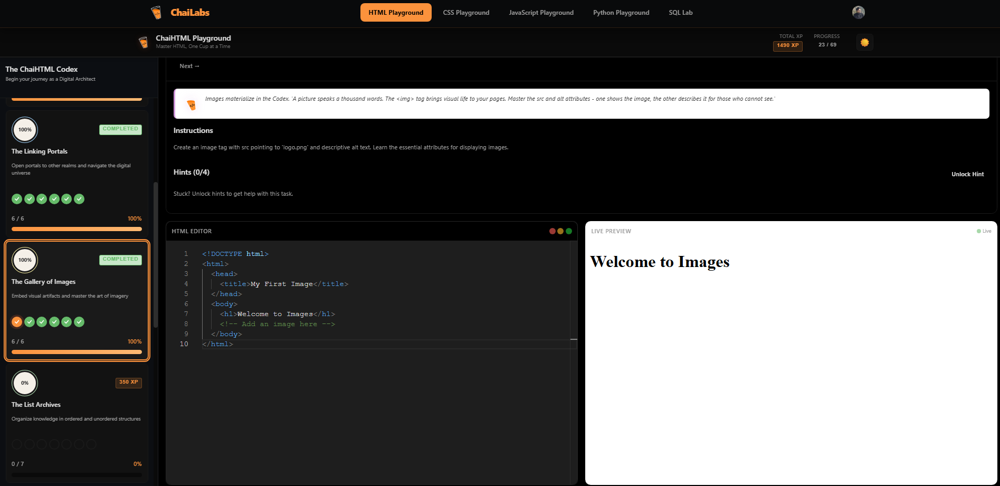
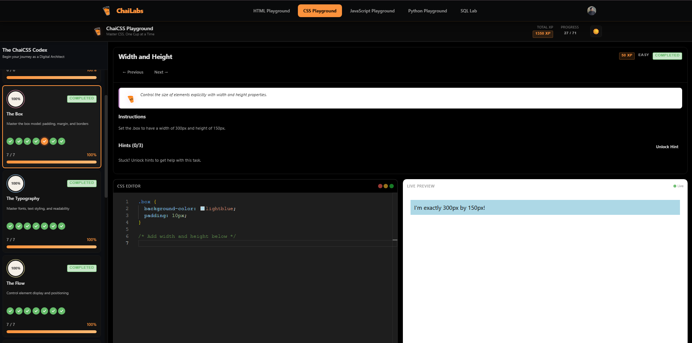

# Learning Full-Stack Development
- [Cohort Link ](https://chaicode.com/cohorts/web-dev)

## My Work Here 
#### HTML + CSS
- [Cursor Landing Page Clone 👉🏻](https://cursor-clone-pi.vercel.app/)
    - [Github Repository 👉🏻](https://github.com/gaurav0973/cursor-clone)
#### HTML
- [HTML only webpage 👉🏻](https://html-lake-three.vercel.app/)
    - [Github Repository 👉🏻](https://github.com/gaurav0973/HTML-Resume-Page-Assignment)

## How a website opens in a browser?
## HTML
- [HTML-Labs](https://labs.chaicode.com/)

## CSS
- [Flex-box](https://flexbox.chaicode.com/)
- [Grid](https://grid.chaicode.com/)
- [CSS-Labs](https://labs.chaicode.com/)

    - positioning
        - relative
        - absolute
        - z-index
    - flexbox
        - justify-content => main axis
        - align-items => cross axis
        - flex-direction => row/column
    - grid
        - grid-template-columns
        - grid-template-rows
        - grid-row
        - grid-column
## Tailwind CSS
    - Responsiveness
        - kuch nahi likha => applies to all screen sizes => mobile first
        - sm => small and above => mere desktop ke liye
        - lg => large and above => mere bade desktop ke liye

## Javascipt
    - DataTypes 
        - Premitive 
            - Number 
            - String
            - BigInt
            - undefined
            - null
            - Symbol
            - boolean
        - Non-premetive
            - Object
                - normal object
                - array object
                - function object
    - How Js code executes in the memory (Factory Example)
    - Arrays
    - Objects
        - Deep copy and shallow copy
    - Functions
    - Polyfills
    - Async JS
        - Callbacks
        - Promises
        - Async/Await
    - DOM Manipulation

## Getting Hands Dirty with Backend 
    - API request types
        - GET
        - POST
        - PUT
        - DELETE
    - NodeJS : a little bit of history
        - V8 engine + libuv(c library) + Node.js Bindings => NodeJS
    - NodeJS : creating server and handling apis from scratch
    - How Express makes our life easier 
        - New Paradigm
            - Express
            - Bun
            - Hone
            - Fastify
            - Elysia
    - Express project setup using typescript